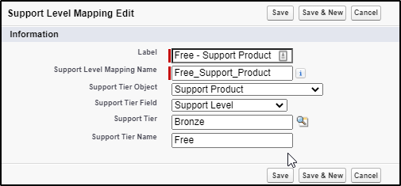

Relationship Fields

# Overview

Creates a relationship that links this custom metadata type to another metadata type, entity definition, or field definition

## Creation

```
Custom Metadata Type Detail > Custom Fields > New > Metadata Relationship
```

## 

### Example

Consider the below objects. We have some **Support Product** with picklist values for tiers: free, premium, VIP. We use **Support Level Mapping** to map these to our existing **Support Tier** metadata type that contains records for Bronze, Silver, and Gold. See image:



#### Objects

**Support Tier**

Record | Default Discount | Minimum Spending
--- | --- | ---
Bronze | xxx | aaa
Silver | yyy | bbb
Gold | zzz | ccc

**Support Level Mapping**

Field Label | Field Name | Field Type | Other Options
--- | --- | --- | --- 
Support Tier Object	 | Support_Tier_Object	 | Metadata Relationship | Related To: Entity Definition
Support Tier Field		 | Support_Tier_Field		 | Metadata Relationship | 	Related To: Field Definition <br>Controlling Field: Support Tier Object
Support Tier		 | Support_Tier		 | Metadata Relationship | Related To: Support Tier (custom metadata type)
Support Tier Name		 | Support_Tier_Name		 | Text	 | 

**Support Product**

Name | Type | Values
--- | --- | ---
Support Level | Picklist | Free, Premium, VIP