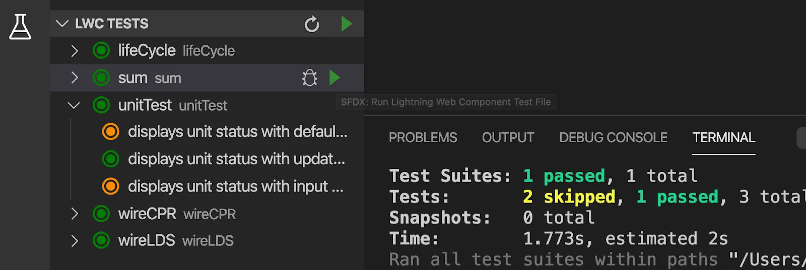

Testing

# Overview

In LWC we use Jest Framework for testing our javascript. It is reliant on node and npm.

**Warning**: some of the tests might fail in the @wire tests due to environmental setup. The concepts still apply, though.


## Setting up Jest
<details>
	<summary>Show details</summary>

1. Install [node](https://nodejs.org/en/download/). It might eventually hang...just crash it and check if it installed

```powershell
node --version
npm --version
```

2. Install sfdx-lwc-jest Node Module in project: 


```powershell
sfdx force:lightning:lwc:test:setup
```

3. IF above doesn't work, try this
```
npm i @salesforce/sfdx-lwc-jest
```

</details>

## Running a Jest Test

<details>
	<summary>Show Details</summary>
	

### From the Command Line

```
node node_modules/@salesforce/sfdx-lwc-jest/bin/sfdx-lwc-jest
```

### Suite from the Command Line

```powershell
npm run test:unit
```

Installation added npm commands as seen below
> package.json

```json
{
  "name": "test-lwc",
  ...  "scripts": {
    ...
    "test:unit": "sfdx-lwc-jest",
    "test:unit:watch": "sfdx-lwc-jest --watch",
    "test:unit:debug": "sfdx-lwc-jest --debug",
    "test:unit:coverage": "sfdx-lwc-jest --coverage",
    ...
  },
  ...}
```

#### Automatically Run on Save Changes

Make sure git is initialized and run

```powershell
npm run test:unit:watch
```

#### Run in Debug Mode

```powershell
npm run test:unit:debug
```

#### Run and Display Coverage

```powershell
npm run test:unit:coverage
```

### From the Sidebar



</details>

## Writing Tests

### Basic JS Example

<details>
	<summary>Show JS test</summary>

In the component folder, create a new folder called ```__tests__```

Add a test (here we test sum.js)

> sum.js

```javascript
export function sum(x, y) {
  return x + y;
}
```

> sum.test.js

```javascript
import { sum } from '../sum';
  
describe('sum()', () => {
  it('should add 1 and 2 returning 3', () => {
    expect(sum(1, 2)).toBe(3);
  });
});
```

* ```describe('Description of Unit Being Tested', [callback function running tests])```
* ```it('Description of expectation', [callback function with assertions)```

</details>

### Basic LWC Example

<details>
	<summary>Show LWC Example</summary>

> unitTest.html

```html
<template>
    <lightning-card title="Unit Status" icon-name="standard:bot">
        <lightning-input
            label="Unit Number"
            value={unitNumber}
            onchange={handleChange} >
      </lightning-input>
      <div class="slds-m-around_medium">
        Unit {unitNumber} alive!
      </div>
    </lightning-card>
  </template>
```

> unitTest.js

```javascript
import { LightningElement, api } from 'lwc';
import { sum } from './sum';
  
export default class UnitTest extends LightningElement {
  @api unitNumber = sum(2,3);
  
   handleChange(event) {
    this.unitNumber = event.target.value;
  }
}
```

> unitTest.test.js

```javascript
import { createElement } from 'lwc';
import UnitTest from 'c/unitTest';
  
describe('c-unit-test', () => {
  afterEach(() => {
    // The jsdom instance is shared across test cases in a single file so reset the DOM
    while(document.body.firstChild) {
      document.body.removeChild(document.body.firstChild);
    }
  });
  
  it('displays unit status with default unitNumber', () => {
    const element = createElement('c-unit-test', {
      is: UnitTest
    });
    expect(element.unitNumber).toBe(5);
    // Add the element to the jsdom instance
    document.body.appendChild(element);
    // Verify displayed greeting
    const div = element.shadowRoot.querySelector('div');
    expect(div.textContent).toBe('Unit 5 alive!');
  });

  it('displays unit status with updated unitNumber', () => {
    const element = createElement('c-unit-test', {
     is: UnitTest
    });
    // Add the element to the jsdom instance
    document.body.appendChild(element);
    // Update unitNumber after element is appended
    element.unitNumber = 6
    const div = element.shadowRoot.querySelector('div');
    // Verify displayed unit status
    expect(div.textContent).toBe('Unit 6 alive!');
  });

  it('displays unit status with input change event', () => {
    const element = createElement('c-unit-test', {
      is: UnitTest
    });
    document.body.appendChild(element);
    const div = element.shadowRoot.querySelector('div');
    // Trigger unit status input change
    const inputElement = element.shadowRoot.querySelector('lightning-input');
    inputElement.value = 7;
    inputElement.dispatchEvent(new CustomEvent('change'));
    return Promise.resolve().then(() => {
      expect(div.textContent).toBe('Unit 7 alive!');
    });
  });
});
```

* ```describe('Description of Unit Being Tested', [callback function running tests])```
* ```it('Description of expectation', [callback function with assertions)```
* ```afterEach(() => {...})``` resets DOM after each test
* ```Promise.resolve().then(() => { ... })``` waits for async update to finish before running test

</details>

### Testing @Wire Services

<details>
	<summary>Show Details</summary>

##### Types
* Generic wire adapter : The generic adapter emits data on demand when you call the emit() API. It does not include any extra information about the data itself.
* Lightning Data Service (LDS) wire adapter : The LDS adapter mimics Lightning Data Service behavior and includes information about the data’s properties.
* Apex wire adapter : The Apex wire adapter mimics calls to an Apex method and includes any error status.

##### Generic Wire Adapter

<details>
	<summary>Show Details</summary>

<details>
	<summary>wireCPR.html</summary>

```html
<template>
    <lightning-card title="Wire CurrentPageReference" icon-name="custom:custom67">
        <pre>{currentPageRef}</pre>
      </lightning-card>
</template>
```

</details>

<details>
	<summary>wireCPR.js</summary>

```js
import { LightningElement, wire } from 'lwc';
import { CurrentPageReference } from 'lightning/navigation';
  
export default class WireCPR extends LightningElement {
  @wire(CurrentPageReference) pageRef;
  get currentPageRef() {
    return this.pageRef ? JSON.stringify(this.pageRef, null, 2) : '';
  }
}
```

</details>

<details>
	<summary>__tests__/data/CurrentPageReference.json</summary>

```json
{
  "type": "standard__navItemPage",
  "attributes": {
    "apiName": "Wire"
  },
  "state": {}
}
```

</details>

<details>
	<summary>wireCPR.test.js</summary>

```javascript
import { createElement } from 'lwc';
import WireCPR from 'c/wireCPR';
import { CurrentPageReference } from 'lightning/navigation';
import { registerTestWireAdapter } from '@salesforce/sfdx-lwc-jest';
  
// Mock realistic data
const mockCurrentPageReference = require('./data/CurrentPageReference.json');
  
// Register a standard test wire adapter.
const currentPageReferenceAdapter = registerTestWireAdapter(
  CurrentPageReference
);
  
describe('c-wire-c-p-r', () => {
  afterEach(() => {
    while (document.body.firstChild) {
      document.body.removeChild(document.body.firstChild);
    }
  });
  
  it('renders the current page reference in <pre> tag', () => {
    const element = createElement('c-wire-c-p-r', {
      is: WireCPR
    });
    document.body.appendChild(element);
  
    // Select element for validation
    const preElement = element.shadowRoot.querySelector('pre');
    expect(preElement).not.toBeNull();
  
    // Emit data from @wire
    currentPageReferenceAdapter.emit(mockCurrentPageReference);
  
    return Promise.resolve().then(() => {
      expect(preElement.textContent).toBe(
        JSON.stringify(mockCurrentPageReference, null, 2)
      );
    });
  });
});
```

</details>


</details>

##### Lightning Data Service Adapter

<details>
	<summary>Show Details</summary>

<details>
	<summary>wireLDS.html</summary>

```html
<template>
    <lightning-card title="Wire Lightning Data Service" icon-name="custom:custom108">
        <template if:true={account.data}>
          <p class="accountName">Account Name: {name}</p>
          <p class="accountIndustry">Industry: {industry}</p>
          <p class="accountPhone">Phone: {phone}</p>
          <p class="accountOwner">Owner: {owner}</p>
        </template>
        <template if:true={account.error}>
          <p>No account found.</p>
        </template>
      </lightning-card>
</template>
```

</details>

<details>
	<summary>wireLDS.js</summary>

```js
import { LightningElement, api, wire } from 'lwc';
import { getRecord, getFieldValue } from 'lightning/uiRecordApi';
import NAME_FIELD from '@salesforce/schema/Account.Name';
import OWNER_NAME_FIELD from '@salesforce/schema/Account.Owner.Name';
import PHONE_FIELD from '@salesforce/schema/Account.Phone';
import INDUSTRY_FIELD from '@salesforce/schema/Account.Industry';
  
export default class WireLDS extends LightningElement {
  @api recordId;
  
  @wire(getRecord, { recordId: '$recordId', fields: [NAME_FIELD, INDUSTRY_FIELD], optionalFields: [PHONE_FIELD, OWNER_NAME_FIELD] })
  account;
  
  get name() {
    return getFieldValue(this.account.data, NAME_FIELD);
  }
  
  get phone() {
    return getFieldValue(this.account.data, PHONE_FIELD);
  }
  
  get industry(){
    return getFieldValue(this.account.data, INDUSTRY_FIELD);
  }
  
  get owner() {
    return getFieldValue(this.account.data, OWNER_NAME_FIELD);
  }
}
```

</details>

<details>
	<summary>__tests__/data/getRecord.json</summary>

```json
{
    "apiName" : "Account",
    "childRelationships" : { },
    "eTag" : "35f2effe0a85913b45011ae4e7dae39f",
    "fields" : {
      "Industry" : {
        "displayValue" : "Banking",
        "value" : "Banking"
      },
      "Name" : {
        "displayValue" : null,
        "value" : "Company ABC"
      },
      "Owner" : {
        "displayValue" : "Test User",
        "value" : {
          "apiName" : "User",
          "childRelationships" : { },
          "eTag" : "f1a72efecde2ece9844980f21b4a0c25",
          "fields" : {
            "Id" : {
              "displayValue" : null,
              "value" : "005o0000000KEEUAA4"
            },
            "Name" : {
              "displayValue" : null,
              "value" : "Test User"
            }
          },
          "id" : "005o0000000KEEUAA4",
          "lastModifiedById" : "005o0000000KEEUAA4",
          "lastModifiedDate" : "2019-08-22T23:45:53.000Z",
          "recordTypeInfo" : null,
          "systemModstamp" : "2019-08-23T06:00:11.000Z"
        }
      },
      "OwnerId" : {
        "displayValue" : null,
        "value" : "005o0000000KEEUAA4"
      },
      "Phone" : {
        "displayValue" : null,
        "value" : "867-5309"
      }
    },
    "id" : "0011J00001A3VFoQAN",
    "lastModifiedById" : "005o0000000KEEUAA4",
    "lastModifiedDate" : "2020-02-28T05:46:17.000Z",
    "recordTypeInfo" : null,
    "systemModstamp" : "2020-02-28T05:46:17.000Z"
  }
```

</details>

<details>
	<summary>wireLDS.test.js</summary>

```javascript
import { createElement } from 'lwc';
import WireLDS from 'c/wireLDS';
import { getRecord } from 'lightning/uiRecordApi';
import { registerLdsTestWireAdapter } from '@salesforce/sfdx-lwc-jest';
  
// Mock realistic data
const mockGetRecord = require('./data/getRecord.json');
  
// Register as an LDS wire adapter
const getRecordAdapter = registerLdsTestWireAdapter(getRecord);
  
describe('c-wire-l-d-s', () => {
  afterEach(() => {
    while (document.body.firstChild) {
      document.body.removeChild(document.body.firstChild);
    }
  });
  
  describe('getRecord @wire data', () => {
    it('renders contact details', () => {
      const element = createElement('c-wire-l-d-s', {
        is: WireLDS
      });
      document.body.appendChild(element);
  
      // Emit data from @wire
      getRecordAdapter.emit(mockGetRecord);
  
      return Promise.resolve().then(() => {
        // Select elements for validation
        const nameElement = element.shadowRoot.querySelector('p.accountName');
        expect(nameElement.textContent).toBe(
          'Account Name: ' + mockGetRecord.fields.Name.value
        );
  
        const industryElement = element.shadowRoot.querySelector('p.accountIndustry');
        expect(industryElement.textContent).toBe(
          'Industry: ' + mockGetRecord.fields.Industry.value
        );
  
        const phoneElement = element.shadowRoot.querySelector('p.accountPhone');
        expect(phoneElement.textContent).toBe(
          'Phone: ' + mockGetRecord.fields.Phone.value
        );
  
        const ownerElement = element.shadowRoot.querySelector('p.accountOwner');
        expect(ownerElement.textContent).toBe(
          'Owner: ' + mockGetRecord.fields.Owner.displayValue
        );
      });
    });
  });
  
  describe('getRecord @wire error', () => {
    it('shows error message', () => {
      const element = createElement('c-wire-l-d-s', {
        is: WireLDS
      });
      document.body.appendChild(element);
  
      // Emit error from @wire
      getRecordAdapter.error();
  
      return Promise.resolve().then(() => {
        const errorElement = element.shadowRoot.querySelector('p');
        expect(errorElement).not.toBeNull();
        expect(errorElement.textContent).toBe('No account found.');
      });
    });
  });
});
```

</details>


</details>

##### Apex Wire Adapter

<details>
	<summary>Show Details</summary>

<details>
	<summary>wireApex.html</summary>

```html
<template>
    <lightning-card title="Wire Apex" icon-name="custom:custom107">
        <template if:true={accounts}>
          <template for:each={accounts} for:item="account">
            <p key={account.Id}>{account.Name}</p>
          </template>
        </template>
        <template if:true={error}>
          <p>No accounts found.</p>
        </template>
      </lightning-card>
</template>
```

</details>

<details>
	<summary>wireApex.js</summary>

```js
import { LightningElement, wire } from 'lwc';
import getAccountList from '@salesforce/apex/AccountController.getAccountList';
  
export default class WireApex extends LightningElement {
  accounts;
  error;
  
  @wire(getAccountList)
  wiredAccounts({ error, data }) {
    if(data) {
      this.accounts = data;
      this.error = undefined;
    } else if(error) {
      this.error = error;
      this.accounts = undefined;
    }
  }
}
```

</details>

<details>
	<summary>__tests__/data/getAccountList.json</summary>

```json
[
    {
      "Id": "001o0000005w4fT",
      "Name": "Edge Communications"
    },
    {
      "Id": "001o0000005w4fa",
      "Name": "United Oil & Gas Corporation"
    },
    {
      "Id": "001o0000005w4fY",
      "Name": "Express Logistics and Transport"
    },
    {
      "Id": "001o0000005w4fV",
      "Name": "Pyramid Construction Inc."
    },
    {
      "Id": "001o0000005w4fX",
      "Name": "Grand Hotels & Resorts Ltd"
    },
    {
      "Id": "001o000000k2NMs",
      "Name": "ABC Genius Tech Consulting"
    }
  ]
```

</details>

<details>
	<summary>__tests__/data/getAccountListNoRecords.json</summary>

```json
[]
```

</details>

<details>
	<summary>wireApex.test.js</summary>

```javascript
import { createElement } from 'lwc';
import WireApex from 'c/wireApex';
import { registerApexTestWireAdapter } from '@salesforce/sfdx-lwc-jest';
import getAccountList from '@salesforce/apex/AccountController.getAccountList';
  
// Realistic data with a list of contacts
const mockGetAccountList = require('./data/getAccountList.json');
  
// An empty list of records to verify the component does something reasonable
// when there is no data to display
const mockGetAccountListNoRecords = require('./data/getAccountListNoRecords.json');
  
// Register as Apex wire adapter. Some tests verify that provisioned values trigger desired behavior.
const getAccountListAdapter = registerApexTestWireAdapter(getAccountList);
  
describe('c-wire-apex', () => {
  afterEach(() => {
    while (document.body.firstChild) {
      document.body.removeChild(document.body.firstChild);
    }
    // Prevent data saved on mocks from leaking between tests
    jest.clearAllMocks();
  });
  
  describe('getAccountList @wire data', () => {
    it('renders six records', () => {
      const element = createElement('c-wire-apex', {
        is: WireApex
      });
      document.body.appendChild(element);
  
      // Emit data from @wire
      getAccountListAdapter.emit(mockGetAccountList);
  
      return Promise.resolve().then(() => {
        // Select elements for validation
        const accountElements = element.shadowRoot.querySelectorAll('p');
        expect(accountElements.length).toBe(mockGetAccountList.length);
        expect(accountElements[0].textContent).toBe(mockGetAccountList[0].Name);
      });
    });
  
    it('renders no items when no records are returned', () => {
      const element = createElement('c-wire-apex', {
        is: WireApex
      });
      document.body.appendChild(element);
  
      // Emit data from @wire
      getAccountListAdapter.emit(mockGetAccountListNoRecords);
  
      return Promise.resolve().then(() => {
        // Select elements for validation
        const accountElements = element.shadowRoot.querySelectorAll('p');
        expect(accountElements.length).toBe(
          mockGetAccountListNoRecords.length
        );
      });
    });
  });
  
  describe('getAccountList @wire error', () => {
    it('shows error panel element', () => {
      const element = createElement('c-wire-apex', {
        is: WireApex
      });
      document.body.appendChild(element);
  
      // Emit error from @wire
      getAccountListAdapter.error();
  
      return Promise.resolve().then(() => {
        const errorElement = element.shadowRoot.querySelector('p');
        expect(errorElement).not.toBeNull();
        expect(errorElement.textContent).toBe('No accounts found.');
      });
    });
  });
});
```

</details>


</details>

</details>

### Mocking Other Components

<details>
	<summary>Show Details</summary>
	
#### Modifying Base Components (\<lightning-button> example)

<details>
	<summary>Show Details</summary>
	
	Add these folders
	
	```
	force-app/test/jest-mocks/lightning
	```
	
	Modify ```jest.config.js```
	
	```json
	  moduleNameMapper: {
    '^lightning/button$': '<rootDir>/force-app/test/jest-mocks/lightning/button'
  }
	```
	
	Create button.html/button.js
	
	> button.html
	
	```html
	<template></template>
	```
	
	> button.js
	
	```javascript
	import { LightningElement, api } from 'lwc';
  
	export default class Button extends LightningElement {
	  @api disabled;
	  @api iconName;
	  @api iconPosition;
	  @api label;
	  @api name;
	  @api type;
	  @api value;
	  @api variant;
	}
	```
	
</details>

</details>