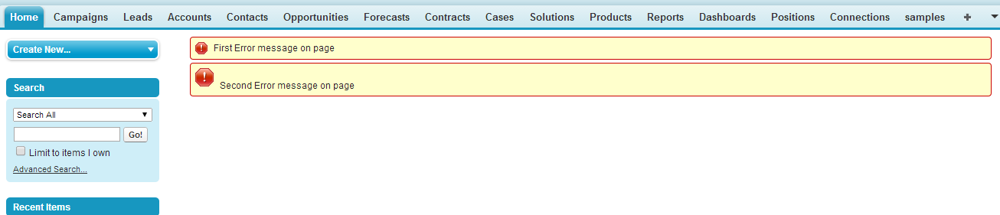
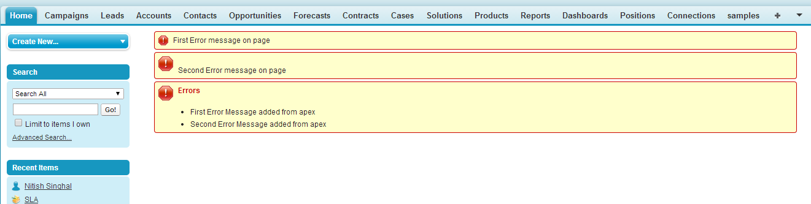

Error Message Components

## [\<apex:pageMessage>](https://developer.salesforce.com/docs/atlas.en-us.pages.meta/pages/pages_compref_pageMessage.htm)

Displays a **single**, **static** message written in Visualforce. **NO** controller interaction required.

```html
<apex:page controller="theController">
<apex:pageMessage severity="Error" summary="First Error message on page" strength="1"/>
<apex:pageMessage severity="Error" detail="Second Error message on page" strength="2"/>
</apex:page>
```


## [\<apex:pageMessages>](https://developer.salesforce.com/docs/atlas.en-us.pages.meta/pages/pages_compref_pageMessages.htm)

Displays **multiple** Salesforce error message (system generated), and we add custom message to is with the controller.

```html
<apex:page controller="theController">
<apex:pageMessage severity="Error" summary="First Error message on page" strength="1"></apex:pageMessage>
<apex:pageMessage severity="Error" detail="Second Error message on page" strength="2"></apex:pageMessage>
<apex:pageMessages ></apex:pageMessages>
 
</apex:page>
```

```apex
public class theController {
 
public theController(){
 
	ApexPages.addmessage(new ApexPages.message(ApexPages.severity.Error, 'First Error Message added from apex'));
	ApexPages.addmessage(new ApexPages.message(ApexPages.severity.Error, 'Second Error Message added from apex'));
 
	}
}
```



## [\<apex:message>](https://developer.salesforce.com/docs/atlas.en-us.pages.meta/pages/pages_compref_message.htm)

Message **associated** with a specific component

```html
<apex:page controller="MyController" tabStyle="Account">

<apex:form > 
        <apex:pageBlock title="Hello {!$User.FirstName}!">
        This is your new page for the {!name} controller. <br/>
        You are viewing the {!account.name} account.

        <p>Number of Locations: <apex:inputField value="{!account.NumberofLocations__c}" 
            id="Location_validation"/> 
        (Enter an alphabetic character here, then click Save to see what happens.) </p>
           
        <p>Number of Employees: <apex:inputField value="{!account.NumberOfEmployees}"
            id="Employee_validation"/> 
        (Enter an alphabetic character here, then click Save to see what happens.) </p>
            <p /> 
        <apex:commandButton action="{!save}" value="Save"/>    
         <p />
        <apex:message for="Location_validation" styleClass="locationError" /> <p /> 
        <apex:message for="Employee_validation" styleClass="employeeError" />   <p />   
        </apex:pageBlock>  
    </apex:form>  
</apex:page>
```

```apex
public class MyController {
    Account account;

    public PageReference save() {
    try{
        update account;
    }
    catch(DmlException ex){
        ApexPages.addMessages(ex);
    }
    return null;
    }

    public String getName() { 
        return 'MyController';
    }

    public Account getAccount() {
        if(account == null)
        account = [select id, name, numberofemployees, numberoflocations__c from Account
        where id = :ApexPages.currentPage().getParameters().get('id')];
        return account;
    }
}
```

## [\<apex:message>](https://developer.salesforce.com/docs/atlas.en-us.pages.meta/pages/pages_compref_messages.htm)

Displays messages generated from **all** components on the page

```html
<apex:page controller="MyController" tabStyle="Account">
    <apex:messages />
    <apex:form > 
        <apex:pageBlock title="Hello {!$User.FirstName}!">
        This is your new page for the {!name} controller. <br/>
        You are viewing the {!account.name} account.

        <p>Number of Locations: <apex:inputField value="{!account.NumberofLocations__c}" 
            id="Location_validation"/> 
        (Enter an alphabetic character here, then click save to see what happens.) </p>
           
        <p>Number of Employees: <apex:inputField value="{!account.NumberOfEmployees}" 
            id="Employee_validation"/> 
        (Enter an alphabetic character here, then click save to see what happens.) </p>
            <p /> 
        <apex:commandButton action="{!save}" value="Save"/>    
         <p />
        </apex:pageBlock>  
    </apex:form>  
</apex:page>
```

```apex
public class MyController {
    Account account;

    public PageReference save() {
    try{
        update account;
    }
    catch(DmlException ex){
        ApexPages.addMessages(ex);
    }
    return null;
    }

    public String getName() { 
        return 'MyController';
    }

    public Account getAccount() {
        if(account == null)
        account = [select id, name, numberofemployees, numberoflocations__c from Account
        where id = :ApexPages.currentPage().getParameters().get('id')];
        return account;

    }
}
```