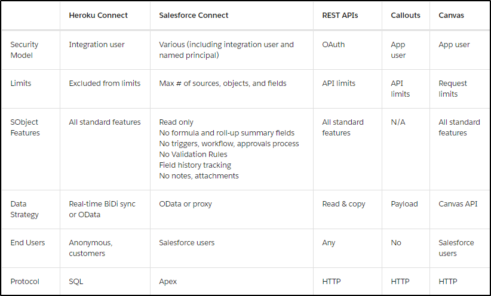
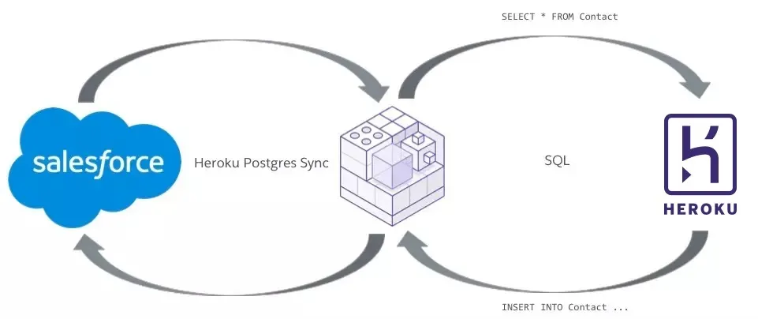
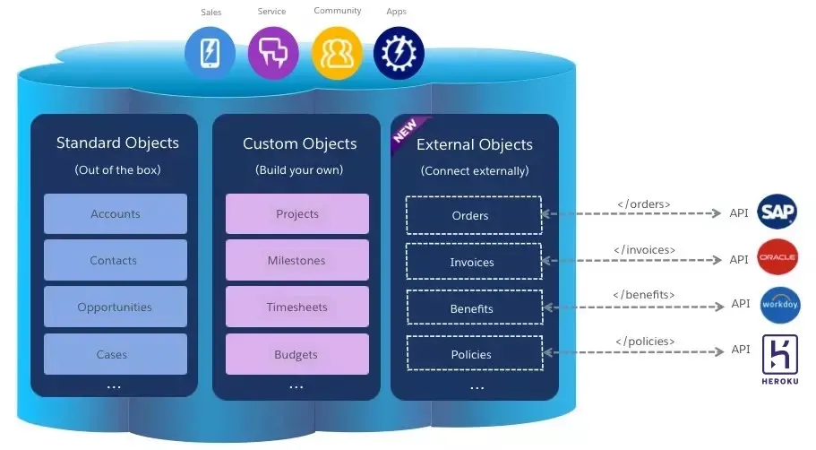
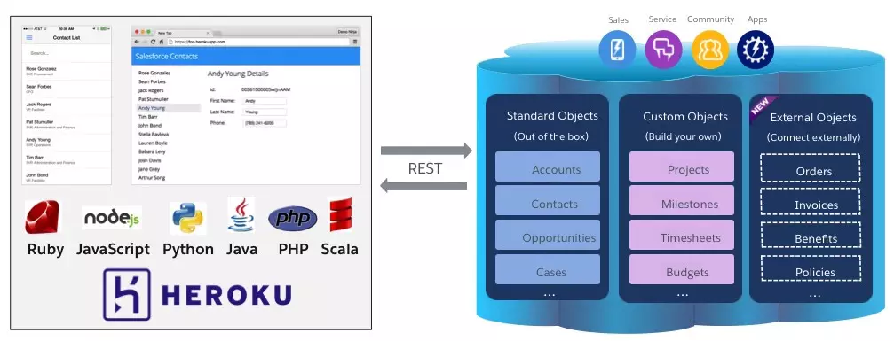
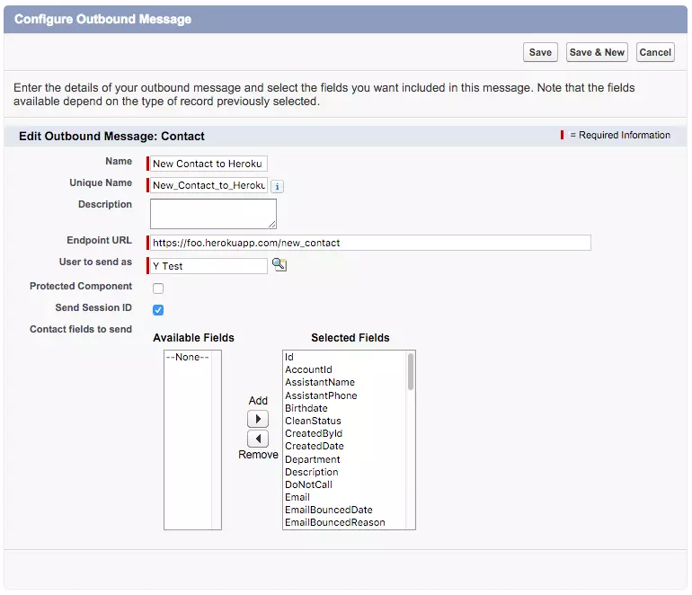
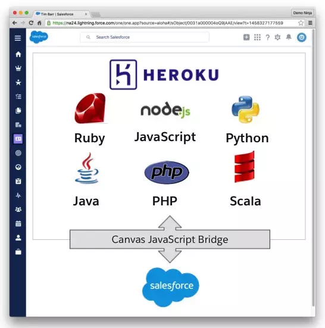

Heroku Integration

# Overview

Modern enterprise systems tend to consist of interconnected microservices, and Heroku is a great way to deploy such services.

## Reasons for Integration

* **Data replication** - copy/synchronize data between systems
* **Data proxies** - accessing data in different locations on-demand (no ETL involved)
* **Custom UIs** - Self explanatory
* **External processes** - outsourcing a specific process to another system (living on Heroku)

## How We Integrate

### Summary



### [Heroku Connect](https://devcenter.heroku.com/articles/heroku-connect)

*Data Replication/Data Proxies*

Connects Salesforce & Heroku through a Postgres DB; one-way OR bidirecitonal.

#### Use
1. Add *Heroku Connect* as an Addon to your instance.
1. Authenticate Salesforce instance with OAuth
2. Configure data mapping



### Salesforce Connect

*Data Proxies*

Get the needed data on demand (can talk through OAuth, REST w/ XML, JSON w/ SOAP). Therefore, data is always up-to-date (unlike ETL)

#### Use
1. Define consumable endpoints in the external app (ex: REST, SOAP)
2. Consume them in Apex

> RealEstateConnection
```Apex
  global class RealEstateConnection extends DataSource.Connection {
 
	 override global List<DataSource.TableResult> search(DataSource.SearchContext searchContext) {
	    return DataSource.SearchUtils.searchByName(searchContext, this);
	  }
	
	override global List<DataSource.Table> sync() {
	  List<DataSource.Column> columns = new List<DataSource.Column>();
	  columns.add(DataSource.Column.text('ExternalId', 255));
	  columns.add(DataSource.Column.url('DisplayUrl'));
	  columns.add(DataSource.Column.text('Name', 128));
	  columns.add(DataSource.Column.text('city', 128));
	  columns.add(DataSource.Column.text('price', 128));
	  List<DataSource.Table> tables = new List<DataSource.Table>();
	  tables.add(DataSource.Table.get('Properties', 'Name', columns));
	  return tables;
	  
	  override global DataSource.TableResult query(DataSource.QueryContext queryContext) {
	   List<Map<String, Object>> properties = DataSource.QueryUtils.process(queryContext, getProperties());
	   DataSource.TableResult tableResult = DataSource.TableResult.get(queryContext, properties);
	   return tableResult;
	 }
	 public List<Map<String, Object>> getProperties() {
	   Http httpProtocol = new Http();
	   HttpRequest request = new HttpRequest();
	   String url = 'https://ionic2-realty-rest-demo.herokuapp.com/properties/';
	   request.setEndPoint(url);
	   request.setMethod('GET');
	   HttpResponse response = httpProtocol.send(request);
	   List<Map<String, Object>> properties = new List<Map<String, Object>>();
	   for (Object item : (List<Object>)JSON.deserializeUntyped(response.getBody())) {
	     Map<String, Object> property = (Map<String, Object>)item;
	     property.put('ExternalId', property.get('id'));
	     property.put('DisplayUrl', 'https://ionic2-realty-rest-demo.herokuapp.com/');
	     property.put('Name', property.get('title'));
	     properties.add(property);
	   }
	   return properties;
	 }
	
	}
}

```



### [Salesforce REST APIs](https://developer.salesforce.com/docs/atlas.en-us.api_rest.meta/api_rest/intro_what_is_rest_api.htm)

*Data Proxies & Custom UIs*

Returns simple JSON-formatted responses to HTTP requests. There's libraries availabile for most common languages (Python, Ruby, etc)

Uses OAuth on a per-user basis.



### Callouts

For using external processes **when a Salesforce event happens.**

#### Using a Workflow (SOAP)

Configuring the rule



On the Heroku side

```javascript
 app.post("/new_contact", function(req, res) {
    var notification = req.body["soapenv:envelope"]["soapenv:body"][0]["notifications"][0];
    var sessionId = notification["sessionid"][0];
    var data = {};
    if (notification["notification"] !== undefined) {
      var sobject = notification["notification"][0]["sobject"][0];
      Object.keys(sobject).forEach(function(key) {
        if (key.indexOf("sf:") == 0) {
          var newKey = key.substr(3);
          data[newKey] = sobject[key][0];
        }
      }); // do something #awesome with the data and sessionId
    }
    res.status(201).end();
  }); 
```

#### Apex Triggers (REST)

Salesforce side example

```apex
 trigger NewContactWebhookTrigger on Contact (after insert) {
  String url = 'https://foo.herokuapp.com/new_contact';
  String content = Webhook.jsonContent(Trigger.new, Trigger.old);
  Webhook.callout(url, content);
} 
```

> Webhook
```Apex
 public class Webhook {
  public static String jsonContent(List<Object> triggerNew, List<Object> triggerOld) {
    String newObjects = '[]';
    if (triggerNew != null) {
      newObjects = JSON.serialize(triggerNew);
    }
    String oldObjects = '[]';
    if (triggerOld != null) {
      oldObjects = JSON.serialize(triggerOld);
    }
    String userId = JSON.serialize(UserInfo.getUserId());
    String content = '{"new": ' + newObjects + ', "old": ' + oldObjects + ', "userId": ' + userId + '}';
    return content;
  }
  @future(callout=true) public static void callout(String url, String content) {
    Http h = new Http();
    HttpRequest req = new HttpRequest();
    req.setEndpoint(url);
    req.setMethod('POST');
    req.setHeader('Content-Type', 'application/json');
    req.setBody(content);
    h.send(req);
  }
} 
```

### Canvas

*Custom UI*

Load external UI into Salesforce and interact with Salesforce data via JS API.



